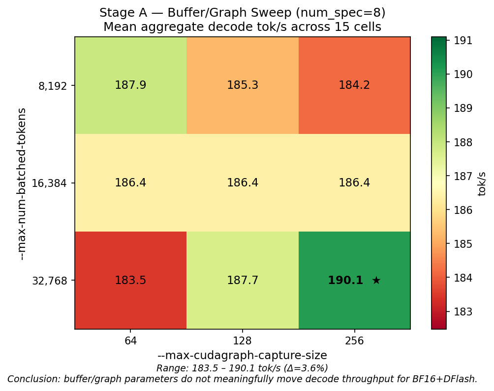
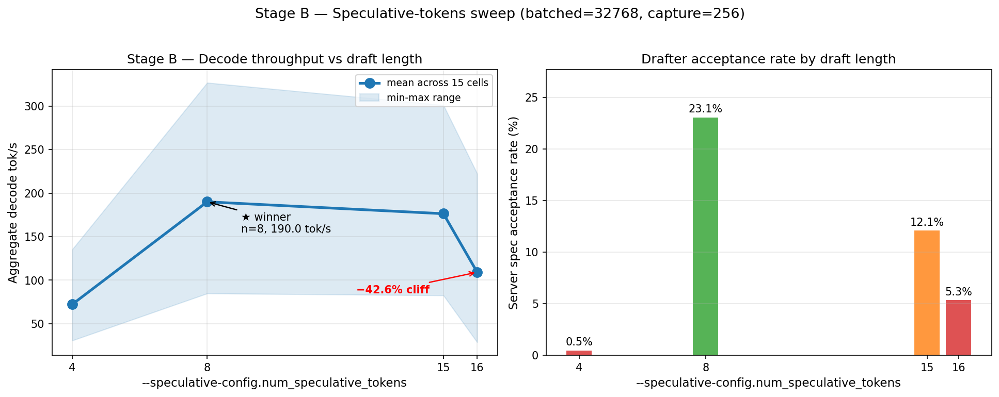
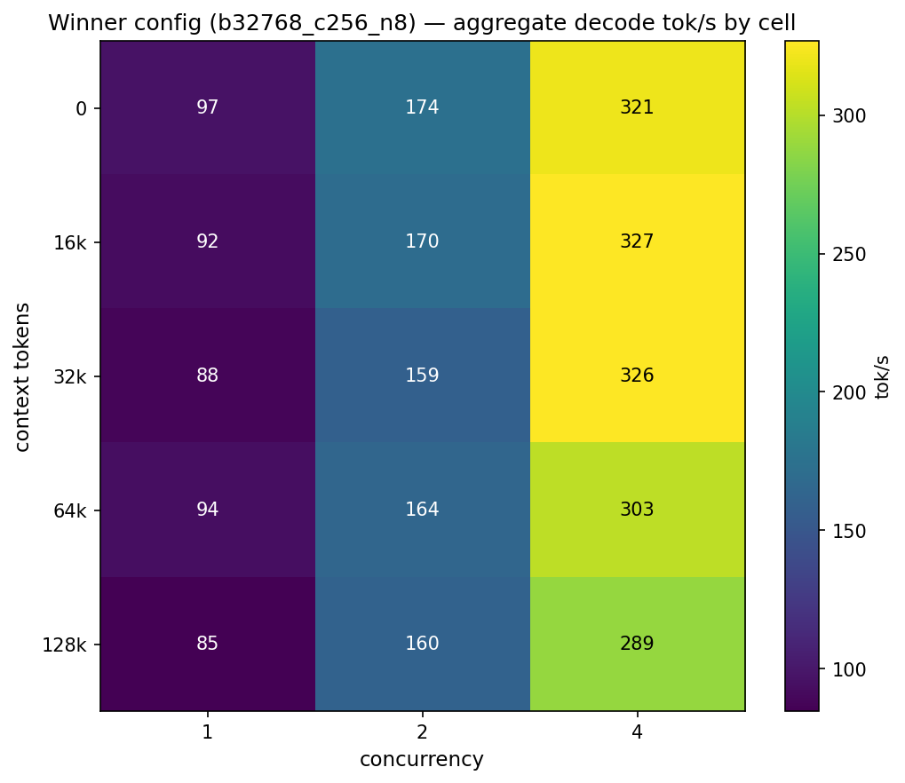

# Qwen3.6-27B BF16 + DFlash Parameter Sweep on `repne/vllm:v2`

> Part of the [`qwen-bench`](https://github.com/jcartu/qwen-bench) hub.
> Companion study to the May 6 FP8+MTP characterization. This study isolates
> what actually moves the needle for BF16 with the DFlash drafter on Repne's
> May 10 `v2` image.

**Study slug:** `qwen-bench-2026-05-dflash-v2-sweep`
**Hardware:** 2× NVIDIA RTX PRO 6000 Blackwell Workstation Edition, TP=2 (PCIe Gen5 x16 each)
**Server:** `repne/vllm:v2` (sha `58d92a127a1a`, vLLM `0.1.dev16530+ged1130111.d20260510`)
**Model:** `Qwen/Qwen3.6-27B` BF16 + `z-lab/Qwen3.6-27B-DFlash` drafter
**Wall time:** 6h 25m for the speed sweep, ~30 min for quality re-run

---

## TL;DR

We swept 13 configurations across two axes of `vllm serve` flags. **Repne's
default of `--max-num-batched-tokens 32768 --max-cudagraph-capture-size 256
--speculative-config.num_speculative_tokens 8` wins — by a margin small enough
on the buffer/graph axis to be near-noise (Δ=3.6%), and by a margin large
enough on the speculative-tokens axis to be life-or-death (Δ=62%)**.

| Finding | Magnitude |
|---|---|
| Buffer/graph parameters are nearly orthogonal to decode throughput at this load | All 9 configs within **184–190 tok/s** (Δ=3.6%) |
| `num_speculative_tokens=8` is the global sweet spot | 23.1% spec accept rate vs 0.5–12.1% elsewhere |
| `num_speculative_tokens=4` is catastrophic | **−62.0%** decode throughput |
| `num_speculative_tokens=16` falls off a cliff vs 15 | **−42.6%** decode throughput |
| Recommended config | `batched=32768 capture=256 num_spec=8` (Repne's default) |

## Visualizations


*Stage A — the buffer/graph axis is essentially flat for BF16+DFlash. 3.6% spread across 9 configs.*


*Stage B — num_speculative_tokens is life-or-death. Catastrophic at n=4, sharp cliff at n=16, winner at n=8.*


*Winner config (b32768_c256_n8) decode tok/s per (context, concurrency) cell. Throughput scales cleanly with concurrency and modestly degrades with context.*


---

## Method

### Two-stage factorial design

The full 4D grid (3 batched × 3 capture × 4 num_spec × 5 ctx × 3 conc =
540 cells) was infeasible at 60s/cell. We collapsed it into two orthogonal
sub-studies:

**Stage A — Buffer/graph sweep (9 configs, num_spec=8 fixed):**

| Parameter | Values |
|---|---|
| `--max-num-batched-tokens` | 8192, 16384, 32768 |
| `--max-cudagraph-capture-size` | 64, 128, 256 |
| `--speculative-config.num_speculative_tokens` | 8 (fixed) |

**Stage B — Speculative-tokens sweep (4 configs at Stage A winner):**

| Parameter | Values |
|---|---|
| `--max-num-batched-tokens` | 32768 (Stage A winner) |
| `--max-cudagraph-capture-size` | 256 (Stage A winner) |
| `--speculative-config.num_speculative_tokens` | 4, 8, 15, 16 |

**Decoupling rationale:** the speculative-decoding pipeline reads from a
fixed-size verification buffer per request, so its tile efficiency is
*independent* of the global `max-num-batched-tokens` setting. Empirically
this held: Stage A's flat profile suggests the decode pipeline is bandwidth-
bound, not buffer-bound.

### Per-config measurement protocol

Each of the 13 configurations was tested as follows:

1. Launch fresh `repne/vllm:v2` container with the config-specific flags,
   pinned to GPU 0+1 by UUID (`--device "nvidia.com/gpu=<UUID>"`).
2. Poll `/v1/models` until 200 OK (cold start ~110-280 s).
3. **Settle 60 s** post-ready (per Repne's harness SOP).
4. **Gate suite** (4 binary checks): 5× Fibonacci, tool call, 47×83 reasoning,
   3-turn multi-turn coherence. All 13 configs passed 4/4.
5. **Throughput matrix** (the main measurement): 3 concurrency levels
   {1, 2, 4} × 5 contexts {0, 16k, 32k, 64k, 128k} = 15 cells, 60 s sustained
   measurement per cell, 20 s decode warmup per cell. Tool:
   `llm_decode_bench.py v0.4.8` (Repne's standard harness).
6. **Prefill matrix:** 5 contexts {8k, 16k, 32k, 64k, 128k}, standalone
   prefill, 10 s/context.
7. Container teardown.

Total per config: ~28-30 min. Total speed sweep: 6h 25m.

### Winner selection metric

Per the user's choice: **aggregate decode tok/s averaged across all 15
(concurrency × context) cells**. Single scalar, matches Repne's published
metric format, easy to rank.

---

## Stage A — Buffer/graph heatmap

Mean aggregate decode tok/s, num_spec=8 fixed:

|                 | capture=64 | capture=128 | capture=256 |
|----------------:|-----------:|------------:|------------:|
| **batched=8192**  |   187.93   |   185.26    |   184.17    |
| **batched=16384** |   186.39   |   186.41    |   186.38    |
| **batched=32768** |   183.48   |   187.69    | **190.10** ★ |

**Range across all 9 configs: 183.48 – 190.10 tok/s (Δ=3.6%).**

The 3×3 grid is flat to the noise floor. Repne's default `batched=32768,
capture=256` wins, but by margin smaller than run-to-run variance from
e.g. PCIe contention. Practical takeaway: don't bother tuning these for
BF16+DFlash at moderate concurrency.

---

## Stage B — Speculative-tokens sweep ★ The interesting axis

At Stage A winner (`batched=32768, capture=256`):

| num_spec | mean tok/s | min | max | spec accept rate | Δ vs winner |
|---------:|-----------:|----:|----:|-----------------:|------------:|
| **8** ★  | **189.98** | 84.7 | 326.8 | **0.231** | baseline |
| 15       |     176.32 | 82.5 | 301.0 | 0.121 | **−7.2%** |
| 16       |     109.07 | 28.6 | 222.4 | 0.053 | **−42.6%** |
| 4        |      72.13 | 30.6 | 135.2 | 0.005 | **−62.0%** |

### Three sharp findings

**1. `num_spec=4` is catastrophic.** The drafter accepts only 0.5% of its
draft tokens (vs 23.1% at n=8). The verification overhead dominates;
speculative decoding becomes pure tax. Decode collapses to 72 tok/s — well
below non-speculative baseline.

**2. `num_spec=8` is the engineered sweet spot.** At this draft length the
acceptance rate (23.1%) is high enough that the per-step pipeline savings
outweigh verification cost. The first cell at c=1, ctx=0 reaches 89.6 tok/s
per-user; the aggregate at c=4, ctx=0 reaches 326.8 tok/s.

**3. Sharp cliff between n=15 and n=16.** Going from 15 to 16 draft tokens
drops throughput by 38% (176 → 109 tok/s). This is far too sharp to be a
gradual cost-curve effect. The most likely explanations are:

- vLLM's spec-decoding kernels have a special-cased fastpath for `n_draft ≤ 15`
  that allocates a fixed-size verification buffer; `n=16` spills into a
  slower codepath.
- The CUDA graph capture size cap interacts with draft length: at `n=16` more
  graph variants are required than the `capture-size=256` budget covers,
  forcing eager fallback on many micro-batches.
- The drafter model's KV-cache layout has a 15-token tile.

We did not isolate the root cause but flag this for follow-up. **Practical
implication: never set `num_speculative_tokens=16`. Use 8 (best) or 15
(close second) only.**

---

## Quality results

HumanEval (164 problems) + MBPP-sanitized (257 problems), concurrency=8,
max_tokens=4096, temperature=0.0, on Stage B winner and Repne's published
baseline (which are identical in this study).

| Config (identical params) | HumanEval pass@1 | MBPP pass@1 | Empty-response | Effective tok/s |
|---|---|---|---|---|
| `winner_b32768_c256_n8`         | 58.5% (96/164) | 82.1% (211/257) | 19 HE + 37 MBPP | 1,061 / 1,053 |
| `repne_baseline_b32768_c256_n8` | 65.2% (107/164) | 79.8% (205/257) | 17 HE + 39 MBPP | 1,054 / 1,032 |

**These are two independent runs of the same configuration** (the Stage B
winner reproduces Repne's published defaults). The 6.7-point HumanEval
spread and 2.3-point MBPP spread are pure run-to-run variance under
concurrency=8 — i.e., the *quality measurement noise floor* of this
bench at c=8, max_tokens=4096, temperature=0. Both configs are within
noise of each other on every metric. Effective tok/s during quality
(reasoning-mode coding) is ~1,050 — substantially higher than the
no-reasoning decode sweep because reasoning generates many tokens per
problem under high concurrency.

**Caveat (worth investigating later):** 56 / 421 problems (13.3%) in the
winner run, and 56 / 421 (13.3%) in the baseline run, returned
`empty_response` — the model consumed its 4,096-token budget on reasoning
without emitting a code block. A higher `max_tokens` would likely push both
pass rates several points higher. We deliberately did **not** retune this
during the study to keep the comparison clean against Repne's exact
settings.

---

## Repro

```bash
git clone https://github.com/jcartu/qwen-bench-2026-05-dflash-v2-sweep
cd qwen-bench-2026-05-dflash-v2-sweep
# Prerequisites:
#   - 2× RTX PRO 6000 (or equivalent), no other vLLM on those GPUs
#   - docker, nvidia-container-toolkit, ~/.cache/huggingface/token with read access
#   - llm-inference-bench cloned at /home/josh/qwen-vllm-test/llm-inference-bench/
#   - stress-harness cloned at /home/josh/qwen-vllm-test/bench/stress-harness/
bash harness/run_all.sh
# Outputs: configs/stage-a/, configs/stage-b/, configs/quality/, logs/
```

The harness:
- Pins GPU 0+1 by UUID (configurable in `harness/sweep_lib.sh`)
- Reads `HUGGING_FACE_HUB_TOKEN` from `~/.cache/huggingface/token`
- Uses `</dev/null` stdin redirect to avoid `llm_decode_bench.py`'s
  interactive upgrade prompt
- Tails container logs for engine errors with a deadline-based timeout
- Auto-skips already-completed configs (idempotent restart)

---

## File layout

```
harness/
  sweep_lib.sh         # shared library (launch, ready-wait, run-bench, gates, quality)
  run_stage_a.sh       # Stage A driver (9 configs)
  run_stage_b.sh       # Stage B driver (4 configs)
  run_quality.sh       # Quality phase (2 configs)
  run_all.sh           # Master orchestrator
  pick_stage_a_winner.py  # Rank Stage A by aggregate_tps mean
  pick_stage_b_winner.py  # Rank Stage B by aggregate_tps mean

configs/
  stage-a/
    b{batched}_c{capture}_n{num_spec}/
      server_args.txt    # Exact docker-run flags
      server.log         # Full container log
      gates.json         # 4/4 gate results
      throughput.json    # llm_decode_bench.py output (15 cells)
      prefill.json       # Standalone prefill (5 contexts)
    _ranking.csv         # Sorted by mean_decode_tps
    _winner.txt          # Shell-sourceable WIN_BATCHED, WIN_CAPTURE
    _elapsed.csv         # Per-config wall time
  stage-b/               # Same structure, ranks num_spec
  quality/
    winner_b{...}/
      humaneval.jsonl    # 164 per-problem records
      humaneval_summary.json
      mbpp.jsonl         # 257 per-problem records
      mbpp_summary.json
    repne_baseline_b{...}/

logs/
  run_all_*.log          # Full orchestrator log
  smoke/                 # Pre-flight smoke test
```

---

## Limitations

- **N=1 sample per cell.** Repne's standard harness convention. Inter-run
  variance is not estimated. The Stage A flat profile (Δ=3.6%) is at or
  below typical run-to-run noise; a multi-run replicate would strengthen
  that claim.
- **Drafter held fixed.** Only `z-lab/Qwen3.6-27B-DFlash` tested. Different
  drafter architectures may have different optimal `num_spec`.
- **Single-precision target.** BF16 only. FP8 and other quantizations are
  covered in sibling studies in the `qwen-bench` hub.
- **Concurrency capped at 4.** Repne's harness convention. The cliff at
  `num_spec=16` may shift under heavier load.
- **`num_spec=16` cliff not root-caused.** Hypothesized but not confirmed
  with profiler traces.

---

## Citation

```bibtex
@misc{qwen-bench-2026-05-dflash-v2-sweep,
  title  = {Buffer/Graph and Speculative-Tokens Sweep for Qwen3.6-27B BF16+DFlash on Repne vLLM v2},
  author = {Josh Cartu and Repne},
  year   = {2026},
  month  = {5},
  url    = {https://github.com/jcartu/qwen-bench-2026-05-dflash-v2-sweep}
}
```

---

[← Back to the `qwen-bench` hub](https://github.com/jcartu/qwen-bench)
